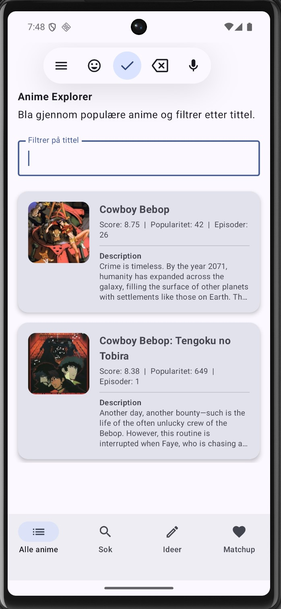
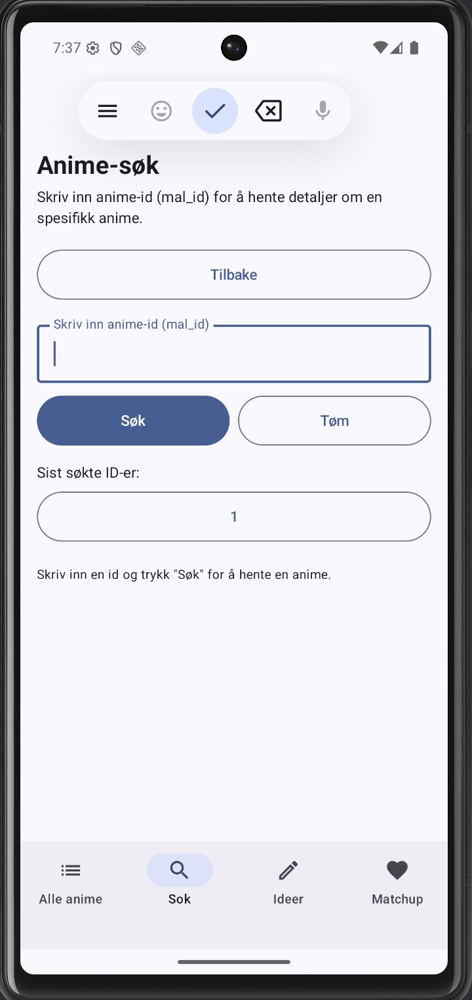
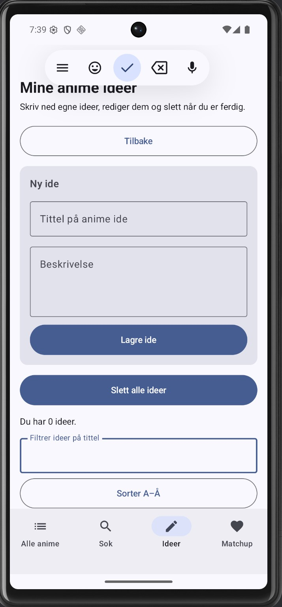
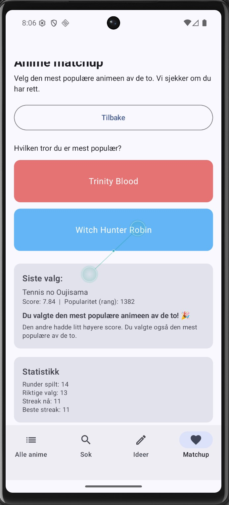

# AnimeApp — Android-eksamen (PGR208)

Android-app laget som gruppeeksamen i emnet **PGR208 Android Programmering** ved Høyskolen Kristiania (frontend og mobilutvikling), høsten 2025. Gruppearbeid (3 personer).

AnimeApp lar deg utforske anime hentet fra et API, søke opp en spesifikk anime via ID, lagre egne anime-idéer lokalt, og spille et lite "hva er mest populær"-matchup-spill.

## Skjermer

| Anime-liste | Søk på ID |
|---|---|
|  |  |

| Egne idéer (Room) | Matchup-spill |
|---|---|
|  |  |

1. **Alle anime** — henter og viser en liste over populære anime fra API-et, med filtrering på tittel.
2. **Søk** — slå opp en spesifikk anime basert på ID.
3. **Idéer** — CRUD-skjerm bygget på en lokal Room-database, hvor man kan lagre, redigere, filtrere og slette egne anime-idéer.
4. **Matchup** — et lite spill hvor man gjetter hvilken av to anime som er mest populær, med løpende statistikk (streak, antall riktige).

## Teknologier

- Kotlin + Jetpack Compose (deklarativ UI)
- MVVM-arkitektur (ViewModel + UI state per skjerm)
- Retrofit mot et anime-API for liste- og søkefunksjonalitet
- Room database for lokal lagring av egne idéer
- Navigation Compose for navigasjon mellom skjermene
- Coil for bildeinnlasting

## Hva jeg lærte

Dette var min første fulle Android-app bygget på MVVM med flere skjermer som deler tilstand. Sentrale ting jeg jobbet med:
- Strukturere en app i `data` (API + Room), `screens` (UI + ViewModel + UI-state per skjerm) og `navigation`, slik at skjermene ikke blander nettverkskall og UI-logikk.
- Kombinere en ekstern datakilde (API) med en lokal datakilde (Room) i samme app.
- Håndtere asynkron tilstand i Compose (lasting, feil, tomme lister) uten at UI-et låser seg.

## Kjøre prosjektet lokalt

1. Åpne `AnimeApp/` i Android Studio.
2. La Gradle synce (bruker Kotlin DSL, `build.gradle.kts`).
3. Kjør på emulator eller fysisk enhet (`minSdk 24`).

## Kontekst

Eksamensbesvarelsen ble levert i gruppe (kandidatnummer 125, 111, 130) og vurdert med karakter A. Denne repoen inneholder min kopi av gruppens felles kode.
